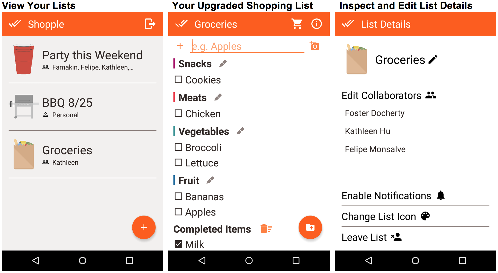

# **Description**
Making a shopping list shouldn't be hard. People today use lists on a fridge, recipes from relatives, or even native notes apps to track the items they want to buy. These solutions are cumbersome and outdated. Moreover, it is nearly impossible to reorganize and collaborate with these options. This is where Shopple comes in.

Using your Facebook account, you can download the app and start making lists in seconds. It's incredibly easy to create, organize, and check off the items you are buying. Furthermore, you can collaborate with friends and family on lists, seeing *live updates* of what you are adding and buying. With amazing features such as directions to nearby stores, notifications to jump straight to your lists, and even Camera OCR to add items by just taking a picture, Shopple is a true upgrade to the shopping experience.

Available in English and Spanish.

# **Screenshots**

# **Team** 

[Foster Docherty, Stanford University](https://www.linkedin.com/in/andrew-foster-docherty-81a1b1133/)

[Felipe Monsalve, Massachusetts Institute of Technology](https://www.linkedin.com/in/felipe-monsalve-44a97812a/)

[Kathleen Hu, Rice University](https://www.linkedin.com/in/kathleen-hu-a20b6b138/)
